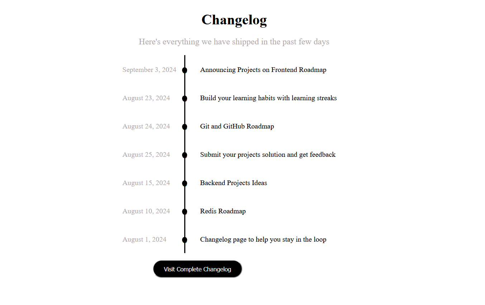

# Changelog Component

## Description
A changelog component that can be used to display the changes made in a project. The component is built using HTML and CSS. The component is responsive and was built with reuability in mine.~